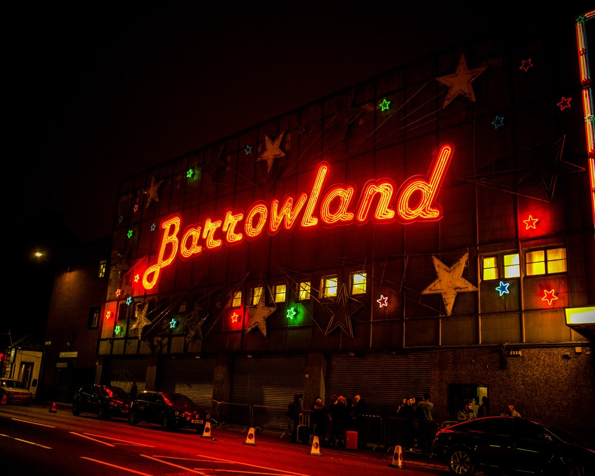

# Your Tour Guide HTML & CSS Template

[](LICENSE)

Your Tour Guide is an open-source HTML & CSS template for tour guides. The template can be used to make personal websites with few minor changes.

## Personalize with these code changes

```html
Just change the text and images in these sections to create your own website. ##
Hero

<h1 id="main-title">Visit Glasgow</h1>
<h2 id="sub-title">A vibrant city in Scotland</h2>

## Activity - Change all three sections under -
<div class="activity-info">
  
  <h3>Concert at the Barrowland</h3>
  <p class=" info-text">
    Barrowland Ballroom is a dance hall and music venue in Glasgow, Scotland.
    The original Barrowland Ballroom opened in 1934
  </p>
  <a href="https://barrowland-ballroom.co.uk/" target="_blank" class="button">Learn more</a>

  ## Guide - Change your image, email & bio

  
  <p id="guide-bio">
    “I have lived in Glasgow for over 30 years, so I can show you all of its
    best parts and hidden secrets.”
  </p>
  <p><b>Martin Graham</b></p>
  <a href="mailto:info@xyz.co" target="_blank" class="button">Contact</a>

  ## Footer - Change "YourGuide Co. to your own name

  <footer>
    &copy;YourGuide Co. | Created by
    <a href="https://github.com/sdas-engineer" target="_blank" id="dev-link">
      Sidharth Das
    </a>
  </footer>
```

## Contributing

If you wish to submit improvements to the HTML, or the CSS, then I welcome forks & pull requests.

## License

Browser Bookmark is released under [MIT](https://choosealicense.com/licenses/mit/) license.
